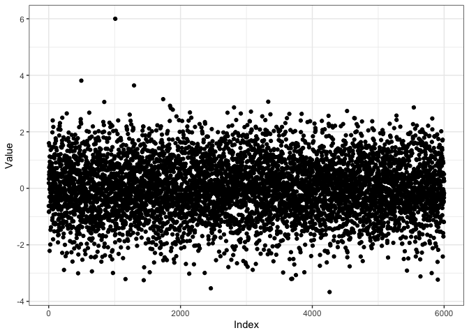
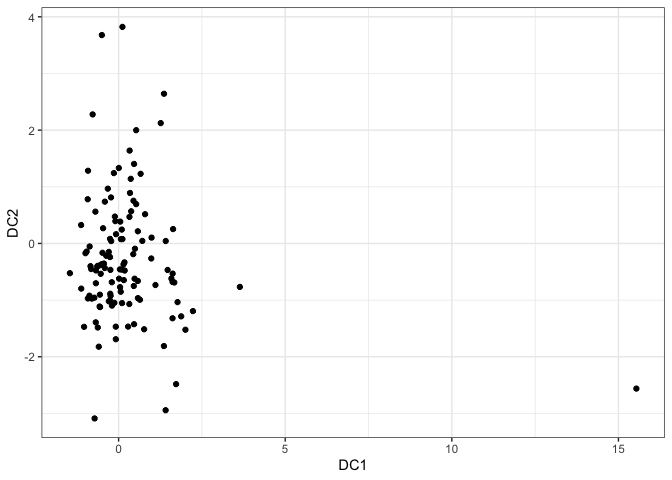
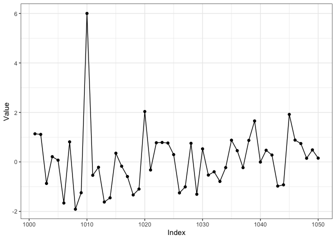
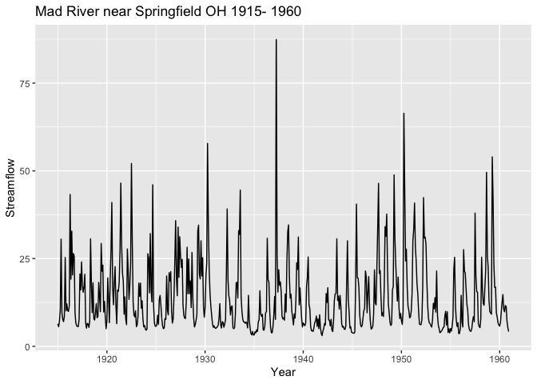
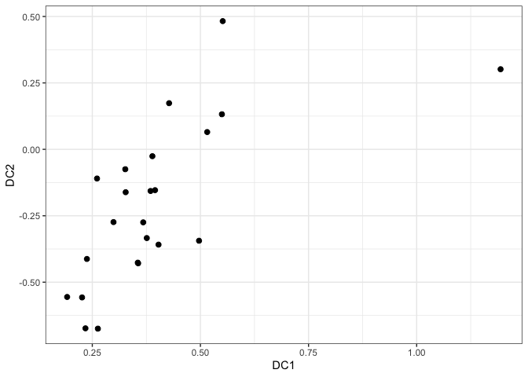
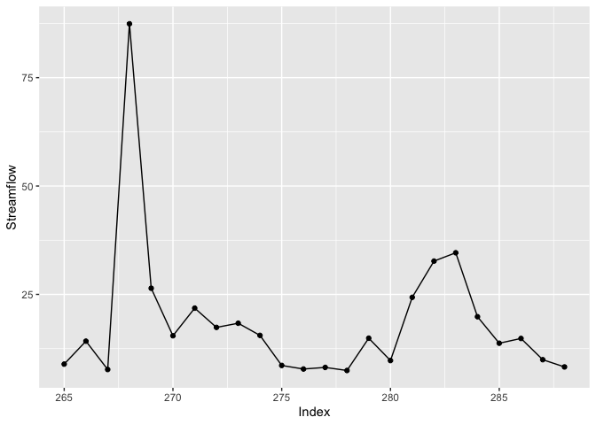

This is a blogpost I did in Nov 2019. I'm posting it again on my new website. 

The R package *dobin* can be used as a dimension reduction tool for outlier detection. So, if we have a dataset of $N$ independent observations,  where each observation is of dimension $p$, *dobin* can be used to find a new basis, such that the outliers of this dataset are highlighted using fewer basis vectors (see [here](https://sevvandi.github.io/dobin/index.html)). 

But, how do we use *dobin* for time series data? *Dobin* is not meant for  raw time series data because it is time-dependent. But we can break a time series into consecutive non-overlapping windows and compute features of data in each window using an R package such as [*tsfeatures*](https://pkg.robjhyndman.com/tsfeatures/). If we compute $d$  features, then data in each time series window will be denoted by a point in $\mathbb{R}^d$. 

## A Synthetic Example
Let's look at an example. We make a normally distributed time series of length $6000$ and  insert an outlier at the position $1010$.


```r
knitr::opts_chunk$set()
library(tsfeatures)
library(dplyr)
library(dobin)
library(ggplot2)

set.seed(1)
# Generate 6000 random normally distributed points for a time series
y <- rnorm(6000)
# Insert an additive outlier at position 1010
y[1010] <- 6
df <- cbind.data.frame(1:6000, y)
colnames(df) <- c("Index", "Value")
ggplot(df, aes(Index, Value)) + geom_point() + theme_bw()
```

<!-- -->

Now, let us break the time series into non-overlapping chunks of length $50$, i.e. we get $120$ chunks or windows. Why do we use non-overlapping windows? If we use overlapping windows, say sliding by $1$, the outlying point in the time series contributes to $50$ windows. Later, when we compute features of these time series windows, these $50$ windows will have similar features, but they will not be outliers in the feature space, because there are $50$ of them. That is why we use non-overlapping windows. 


Also, note that we need the time series to have a decent length to compute features.  For each window we compute time series features using *tsfeatures*.


```r
# Split the time series into windows of length 50
my_data_list <- split(y, rep(1:120, each = 50))
# Compute features of each chunk using tsfeatues
ftrs <- tsfeatures(my_data_list)
head(ftrs)
```

```
## # A tibble: 6 × 16
##   frequency nperiods seasonal_period  trend   spike linearity curvature   e_acf1
##       <dbl>    <dbl>           <dbl>  <dbl>   <dbl>     <dbl>     <dbl>    <dbl>
## 1         1        0               1 0.0506 1.01e-3     0.354    0.212  -0.00211
## 2         1        0               1 0.110  6.68e-4    -0.500    0.0679 -0.147  
## 3         1        0               1 0.201  8.10e-4    -2.18    -0.836  -0.341  
## 4         1        0               1 0.129  5.11e-4    -0.402   -1.57   -0.209  
## 5         1        0               1 0.134  7.74e-4    -0.817    1.39   -0.165  
## 6         1        0               1 0.0673 1.06e-3     0.130    0.681  -0.318  
## # ℹ 8 more variables: e_acf10 <dbl>, entropy <dbl>, x_acf1 <dbl>,
## #   x_acf10 <dbl>, diff1_acf1 <dbl>, diff1_acf10 <dbl>, diff2_acf1 <dbl>,
## #   diff2_acf10 <dbl>
```
It is easier to find a good set of basis vectors that highlight outliers when there are a lot more points compared to the dimensions of the dataset, i.e. $N > p$. In this case the feature space is $16$ dimensional, and we have $120$ points, each point corresponding to a window of the time seires. 

Next we input these time series features to *dobin*. 

```r
ftrs %>% dobin(norm=2) -> out
coords <- as.data.frame(out$coords[ ,1:2])
colnames(coords) <- c("DC1", "DC2")
ggplot(coords, aes(DC1, DC2)) + geom_point() + theme_bw()
```

<!-- -->
In the first and second dobin component space (DC1-DC2 space), we see a point appearing far away near $(15, -5)$. Let's investigate this point.


```r
inds <- which(coords[ ,1] > 10)
inds
```

```
## [1] 21
```
OK, this point is coming from window 21.  Also, this point deviates in the DC1 axis. So, let us look at the first dobin vector. 

```r
# First dobin vector
out$vec[ ,1]
```

```
## NULL
```

```r
colnames(ftrs)
```

```
##  [1] "frequency"       "nperiods"        "seasonal_period" "trend"          
##  [5] "spike"           "linearity"       "curvature"       "e_acf1"         
##  [9] "e_acf10"         "entropy"         "x_acf1"          "x_acf10"        
## [13] "diff1_acf1"      "diff1_acf10"     "diff2_acf1"      "diff2_acf10"
```
The first vector has a high value in **spike** (), which measures the amount of spikiness in a time series. Now, let's have a look at the 21st window of the time series. 


```r
# Make a dataframe from window 21
df2 <- cbind.data.frame((1000 + 1:50), my_data_list[[inds]])
colnames(df2) <- c("Index", "Value")
ggplot(df2, aes(Index, Value)) + geom_point() + geom_line() + theme_bw()
```

<!-- -->
We see that we've picked up the spike corresponding to position $1010$, in the 21st window, because $1010/50 = 20.2$.


## A Real Example
Next we look at a real world example containing the streamflow from Mad River near Springfield, Ohio from 1915- 1960.


```r
library(fpp)
library(ggplot2)
library(tsfeatures)
library(dobin)
library(tsdl)

tt <- tsdl[[77]]
autoplot(tt) +  ggtitle("Mad River near Springfield OH 1915- 1960") +
  xlab("Year") +  ylab("Streamflow")
```

<!-- -->

Let's split the time series into non-overlapping windows and compute features as before. 

```r
my_data_list <- split(tt, rep(1:23, each = 24))
# Compute features of each chunk using tsfeatues
ftrs <- tsfeatures(my_data_list)

ftrs[ ,4:7] %>% dobin() -> out

coords <- as.data.frame(out$coords[ ,1:2])
colnames(coords) <- c("DC1", "DC2")
ggplot(coords, aes(DC1, DC2)) + geom_point(size=2) + theme_bw()
```

<!-- -->
We see a point having a DC1 value greater than 1. Let us investigate that point. 


```r
ind <- which(coords[ ,1] > 1)
ind
```

```
## [1] 12
```

```r
df <- cbind.data.frame((11*24+1):(12*24), my_data_list[[ind]])
colnames(df) <- c("Index", "Streamflow")
ggplot(df, aes(Index, Streamflow)) + geom_point() + geom_line()
```

<!-- -->

We see this point corresponds to the window with the highest spike in the time series, as this is the only spike greater than 75 units. 


So, in summary *dobin* can be used as a dimension reduction technique for outlier detection for time series data,  as long as the data is prepared appropriately. 
